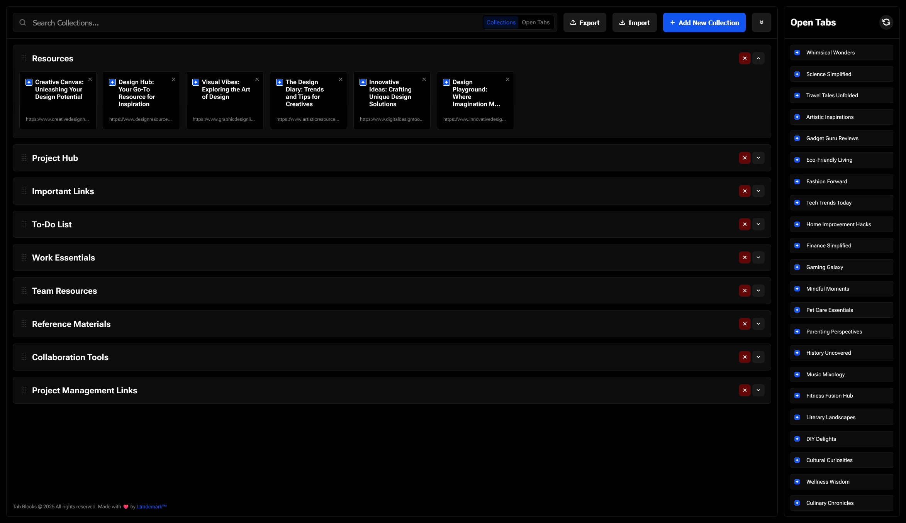

  
  <h1>Tab Blocks for Firefox</h1>
  
   
   
   
  <picture>
    <source media="(prefers-color-scheme: dark)" srcset="./screenshots/screen-dark.png">
    <source media="(prefers-color-scheme: light)" srcset="./screenshots/screen-light.png">
    
  </picture>
   
   
   

* **Custom New Tab Page:** Provides a dedicated space for your organized links every time you open a new tab.
* **Link Collections:**
    * Create new collections to group related links.
    * Rename collections easily.
    * Delete collections you no longer need.
    * Reorder collections using drag-and-drop via a dedicated handle.
    * Collapse or expand individual collections to save space.
    * Collapse or expand all collections at once.
* **Link Blocks:**
    * Add links quickly by dragging currently open tabs from the sidebar into a collection.
    * Saved links display the page title, URL, and favicon.
    * Edit the title of saved links directly within the block.
    * Delete individual links from a collection.
    * Move link blocks between different collections using drag-and-drop.
    * Clicking a link block navigates you to the saved URL.
* **Search & Filter:**
    * Quickly search through your saved links (by title or URL) or your currently open tabs.
    * Use the toggle switch to change the search target between "Collections" and "Open Tabs".
* **Data Management:**
    * **Persistence:** All your collections and links are saved locally using `browser.storage.local` and persist between browser sessions.
    * **Export:** Export your entire configuration (collections and links) to a JSON file for backup or transfer.
    * **Import:**
        * Import configurations previously exported from Tab Blocks.
        * Import data directly from Toby extension export files (prompts to merge or replace).

## Installation

**(Instructions for installing from AMO once published)**

* Visit the Tab Blocks page on the [Firefox Add-ons store](https://addons.mozilla.org/en-US/firefox/addon/tab-blocks/)
* Click "Add to Firefox".

**(Instructions for manual/temporary installation)**

1.  Download the `Tab_Blocks.zip` file from the [Releases Page](https://github.com/ltrademark/Tab-Blocks-for-Firefox/releases). 
2.  Open Firefox and navigate to `about:debugging`.
3.  Click "This Firefox" on the left sidebar.
4.  Click "Load Temporary Add-on...".
5.  Select the downloaded `.zip` file.

## Usage

1.  Open a new tab in Firefox. Tab Blocks will appear.
2.  Use the "Add New Collection" button to create categories.
3.  Drag tabs from the "Open Tabs" sidebar into a collection to save them as link blocks.
4.  Organize collections and links using drag-and-drop, delete buttons, and edit icons.
5.  Use the search bar and toggle to find specific links or open tabs.
6.  Use the Import/Export buttons to manage your configuration data.
